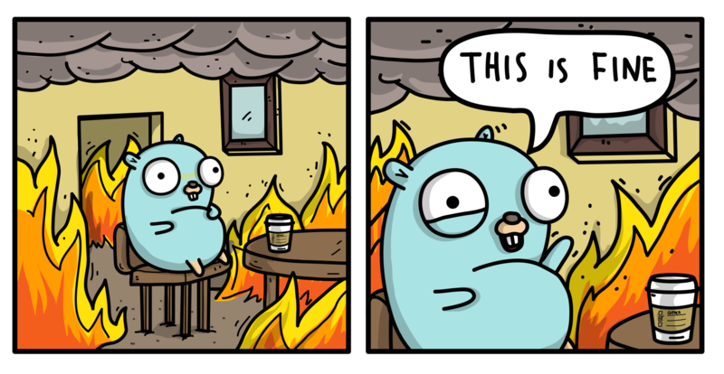

## Charcoal 

[](https://pkg.go.dev/github.com/sugawarayuuta/charcoal)



Faster utf8.Valid using multi-byte processing without SIMD.

### Features

- Fast. Up to 50% faster than the standard library. See the benchmarks section.

- Compatible. Its usage is the same as the standard library.

- Well-tested. Fuzzing is actively done in addition to standard library's tests.

### Installation

```
go get github.com/sugawarayuuta/charcoal
```

### Benchmarks

The left side is the standard library, the right side is this library (Higher is better).

```
                     │ ./before.txt │              ./after.txt              │
                     │     B/s      │      B/s       vs base                │
Valid/ascii-small-4    1.699Gi ± 2%    1.783Gi ± 1%   +4.99% (p=0.000 n=10)
Valid/ascii-large-4    11.01Gi ± 1%    15.82Gi ± 1%  +43.64% (p=0.000 n=10)
Valid/kanji-small-4    982.4Mi ± 1%   1099.9Mi ± 2%  +11.95% (p=0.000 n=10)
Valid/kanji-large-4    890.4Mi ± 1%   1334.1Mi ± 1%  +49.82% (p=0.000 n=10)
Valid/unicode.json-4   821.6Mi ± 7%   1226.3Mi ± 2%  +49.26% (p=0.000 n=10)
geomean                1.658Gi         2.162Gi       +30.44%
```

`ascii-small`: 10 ASCII characters.

`ascii-large`: 100K ASCII bytes.

`kanji-small`: 10 Japanese Kanji characters.

`kanji-large`: 100K Japanese Kanji bytes.

`unicode.json`: Contains many strings with various Unicode runes.

### Thank you

- The icon used is from [ashleymcnamara/gophers](https://github.com/ashleymcnamara/gophers).